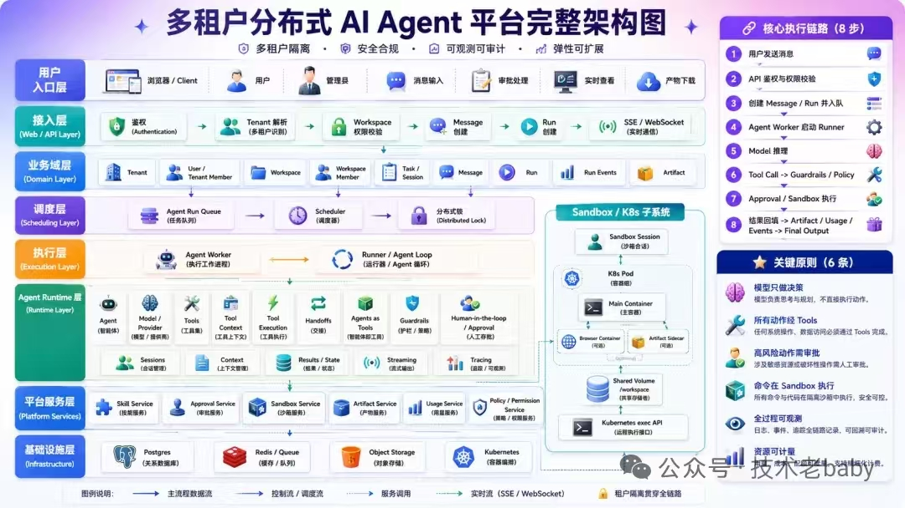

# 多租户分布式 AI Agent 平台

<div align="center">

**企业级 · 安全合规 · 可观测 · 弹性扩展的 AI Agent 运行时**

[]()
[]()
[]()
[]()
[]()

> 模型只做决策 · 动作经 Tools · 高风险审批 · 沙箱执行 · 全程可观测 · 资源可计量

[快速开始](#-快速开始) · [架构](#-架构总览) · [核心能力](#-核心能力) · [部署](#-部署) · [API](#-api-速查)

</div>

---

## 📌 这是什么

一个**生产级的多租户 AI Agent 平台**。它把「让大模型自主调用工具完成任务」这件事，做成了一套可隔离、可审批、可计量、可观测、可扩展的工程系统。

**适合谁**：需要为多个客户/团队提供 AI Agent 能力，且对**安全隔离**、**成本控制**、**合规审计**有硬性要求的团队。

**解决什么问题**：

| 痛点 | 本平台的答案 |
|---|---|
| 多租户数据串台 | 应用层过滤 + PostgreSQL RLS 双重兜底 |
| Agent 执行任意代码有风险 | gVisor 内核级沙箱 + NetworkPolicy 断内网 |
| 高风险操作不可控 | HITL 人工审批闸门 + 声明式风控引擎 |
| 模型成本失控 | 三级预算硬熔断 + EWMA 烧钱预测 + 成本选路 |
| 出问题无法追溯 | RunEvent 全链路审计 + OTel Tracing + 审计回放 |
| 长任务崩溃丢进度 | RunState 检查点 + 崩溃续跑 + pause/resume |

---

## 🏗 架构总览



```
┌────────────────────────────────────────────────────────────────────────┐
│ 用户入口   浏览器 · 控制台 · 管理员 · 消息输入 · 审批 · 实时查看 · 产物下载    │
└────────────────────────────────────────────────────────────────────────┘
                                   │
┌────────────────────────────────────────────────────────────────────────┐
│ 接入层     JWT鉴权 → Tenant解析 → Workspace校验 → Message/Run创建 → SSE/WS  │
└────────────────────────────────────────────────────────────────────────┘
                                   │
┌────────────────────────────────────────────────────────────────────────┐
│ 业务域层   Tenant · Workspace · Session · Message · Run · RunEvent ...     │  ← 全表 tenant_id
└────────────────────────────────────────────────────────────────────────┘
                                   │
┌────────────────────────────────────────────────────────────────────────┐
│ 调度层     Agent Run Queue → Scheduler → Distributed Lock                  │
└────────────────────────────────────────────────────────────────────────┘
                                   │
┌────────────────────────────────────────────────────────────────────────┐
│ 执行层     Agent Worker  →  Runner / Agent Loop                            │
└────────────────────────────────────────────────────────────────────────┘
                                   │
┌────────────────────────────────────────────────────────────────────────┐
│ Runtime层  Agent · ModelRouter · Tools · Handoffs · Guardrails · Approval  │
│            ─────────────────────────────────────────────────────────────  │
│            Sandbox 子系统：gVisor Pod · Browser · Sidecar · exec API        │
└────────────────────────────────────────────────────────────────────────┘
                                   │
┌────────────────────────────────────────────────────────────────────────┐
│ 平台服务   Skill · Approval · Sandbox · Artifact · Usage · Policy · Billing │
└────────────────────────────────────────────────────────────────────────┘
                                   │
┌────────────────────────────────────────────────────────────────────────┐
│ 基础设施   PostgreSQL(RLS) · Redis · Object Storage(S3/MinIO) · Kubernetes  │
└────────────────────────────────────────────────────────────────────────┘

      ━━ 主流程数据流   ┄┄ 控制/调度流   ┈┈ 服务调用   ∿∿ 实时流(SSE/WS)
```

| 组件 | 职责 |
|------|------|
| **api** | REST + SSE + JWT 多租户 |
| **worker** | 消费 Run 队列，执行 Agent 主循环 |
| **scheduler** | 卡住 Run 恢复、审批过期、paused Run 自动 requeue |
| **event-relay / audit-writer / risk-consumer** | Kafka 事件分流、审计落库、风控评估 |
| **Flink** | 1 分钟窗口指标聚合 → risk-metrics |
| **sandbox-reaper** | 清理过期沙箱 |
| **burn-monitor / billing-reporter** | 预算燃烧率、Stripe 用量上报 |

---

## 🔄 核心执行链路（8 步）

```
①发消息 → ②鉴权/权限 → ③创建Run并入队 → ④Worker启动Runner → ⑤模型推理
                                                                    ↓
⑧结果回填(Artifact/Usage/Events) ← ⑦审批/沙箱执行 ← ⑥ToolCall→Guardrails/Policy
```

| # | 步骤 | 实现要点 | 代码位置 |
|---|---|---|---|
| ① | 用户发消息 | 控制台 / REST / WebSocket | `app/api/routes_run.py` |
| ② | 鉴权与权限 | JWT(kid 轮换) → TenantMember → Workspace + RLS | `app/api/deps.py` |
| ③ | 创建 Run 入队 | 事务落库 → Kafka/Redis（按 tenant 分区有序） | `app/scheduling/queue.py` |
| ④ | Worker 启 Runner | 消费组 + 分布式锁 + XAUTOCLAIM 故障接管 | `app/execution/worker.py` |
| ⑤ | 模型推理 | 成本评分选路 → 熔断 failover → 流式 delta | `app/runtime/model_router.py` |
| ⑥ | ToolCall 守卫 | AST 危险命令 + SSRF + 租户策略 + 预算预占 | `app/runtime/guardrails.py` |
| ⑦ | 审批/沙箱执行 | HITL 阻塞 + gVisor Pod exec（容器复用） | `app/runtime/sandbox.py` |
| ⑧ | 结果回填 | Message 落库 + Artifact 上传 + Usage 结算 + 事件广播 | `app/execution/runner.py` |

---

## ⭐ 核心能力

<table>
<tr><td width="50%" valign="top">

### 🔐 多租户隔离（4 层）
- **应用层**：ORM / API 自动注入 `tenant_id`
- **数据库**：PostgreSQL Row-Level Security 兜底
- **网络**：Sandbox NetworkPolicy 按租户隔离（K8s 模式）
- **配额**：Redis Lua 原子预占三级预算

### 📦 安全沙箱（3 后端可切换）
| 后端 | 隔离 | 场景 |
|---|---|---|
| `k8s+gVisor` | 内核级 | 生产 |
| `docker` | 容器级 | 单机 |
| `local` | 进程级 | 开发/CI |

### 🤖 多 Agent 编排
- Handoff 栈式交接
- Agents-as-Tools 子代理
- 检查点崩溃续跑 + pause/resume

</td><td width="50%" valign="top">

### 💰 成本智能
```
有效成本 = 名义成本/(1-失败率) + 延迟惩罚
```
- 跨 Worker Redis 共享 EWMA
- ε-greedy 探索 + 熔断 failover
- **三级预算硬熔断**（run / 租户日 / 平台日）
- EWMA 烧钱预测 → 三级告警

### 🛡 风控引擎
- AST 白名单 DSL（拒绝注入）
- Redis pub/sub **秒级热更新**
- 4 类动作：throttle / flag / pause / notify
- cooldown 去重 + dry-run 回放

### 📊 全链路可观测
- RunEvent 全量审计（Kafka→PG 幂等）
- OpenTelemetry Tracing
- 管理员审计回放 + 路由仪表盘

</td></tr>
</table>

### 🔁 Run 状态机

```
queued ──► running ──► awaiting_approval ──► running
   ▲          │  │                            │
   │          │  └──────► paused ◄────────────┘
   │          │             │
   │          │   (resume: paused ──► queued 重新入队)
   │          ▼             ▼
   └──────  completed / failed / cancelled
```

- **CAS 状态变更**（`WHERE status=from`）→ Worker 与风控并发安全
- **安全点暂停**：仅在 iteration 边界 / 审批间隙截停，保证检查点自洽
- **PAUSED 是正常出口**：Worker ack 不进 DLQ，不污染失败率 EWMA

### 💳 Stripe 计费
阶梯 metered · 多币种 · 优惠券 · **双订阅模型**（年付底价+席位 licensed ↔ 月付 metered 用量）· 席位 proration（需配置 `STRIPE_*`）

---

## 🛠 技术栈

| 层 | 选型 |
|---|---|
| **API** | FastAPI · JWT(kid 轮换 + refresh rotation) · SSE · WebSocket |
| **数据库** | PostgreSQL 16 · SQLAlchemy async · **Alembic 迁移** · **RLS** |
| **缓存/锁/队列** | Redis 7（分布式锁 / 配额 / pub-sub 桥接） |
| **事件总线** | Kafka + Schema Registry / Avro + DLQ（可降级 Redis） |
| **流计算** | Apache Flink（1 分钟窗口聚合 → risk-metrics） |
| **沙箱** | Kubernetes + gVisor RuntimeClass + NetworkPolicy |
| **对象存储** | S3 / MinIO |
| **模型** | 多 Provider（OpenAI / Anthropic / vLLM）+ 成本选路 + 熔断 |
| **计费** | Stripe |
| **可观测** | OpenTelemetry + RunEvent 审计 |
| **前端** | 原生 JS + CSS（零构建工具） |

---

## 🚀 快速开始

### 前置要求

- Docker & Docker Compose v2
- Python 3.12+（本地开发可选）
- 运行 Agent 需配置 **OPENAI_API_KEY**（或自定义 Provider）

### 60 秒启动（本地 mock 沙箱，默认 Redis 事件总线）

`.env.example` 默认 `SANDBOX_BACKEND=local`、`EVENT_BUS=redis`，**无需 Kafka 即可跑通对话**。

```bash
git clone https://github.com/QiShengZhao/MAP.git && cd MAP
cp .env.example .env
# 编辑 JWT_SECRET（≥32 字节）、OPENAI_API_KEY

# 1. 基础设施 + 核心服务
docker compose up -d postgres redis minio api worker scheduler sandbox-reaper

# 2. 初始化数据库（Alembic 建表 + 启用 RLS）
docker compose run --rm api python scripts/init_db.py
# 等价于：alembic upgrade head
```

| 服务 | 地址 |
|---|---|
| 🖥 控制台 | http://localhost:8000 |
| 📖 API 文档 | http://localhost:8000/docs |
| ❤️ 健康检查 | http://localhost:8000/healthz |
| 🗄 MinIO Console | http://localhost:9001（minioadmin / minioadmin） |

### 完整模式（Kafka + Flink + 事件消费者）

```bash
docker compose up -d
docker compose run --rm api python scripts/init_db.py
```

| 服务 | 地址 |
|---|---|
| 🌊 Flink UI | http://localhost:8082 |
| 📋 Schema Registry | http://localhost:8081 |

> `flink-submit` 会在 JobManager 就绪后自动提交 `risk-metric-aggregation` 作业。

### 第一次使用

```
1. 打开控制台 → 注册租户（自动成为 owner）
2. 登录（多租户时选择租户）→ 选择工作区 → 输入任务 → Ctrl+Enter 发送
3. (admin) 风控页：规则 CRUD / dry-run / 暂停管理
   运维页：Run 列表 / 审计时间线 / 模型路由 / 沙箱
   配置页：Policy / Agents / Skills / Billing
```

### 本地开发（Python 热重载）

```bash
python3.12 -m venv .venv && source .venv/bin/activate
pip install -r requirements.txt -r requirements-dev.txt
cp .env.example .env

# 改 DATABASE_URL / REDIS_URL / S3_ENDPOINT 为 localhost
docker compose up -d postgres redis minio
python scripts/init_db.py

uvicorn app.main:app --host 0.0.0.0 --port 8000 --reload   # 终端 1
python -m app.execution.worker                            # 终端 2
python -m app.scheduling.scheduler                        # 终端 3
```

### 数据库迁移

```bash
alembic current                    # 当前版本（初始：0001）
alembic history
alembic revision --autogenerate -m "describe change"
alembic upgrade head
```

> 迁移使用同步 `psycopg2`；应用运行时仍用 `asyncpg`，`DATABASE_URL` 在 `alembic/env.py` 中自动转换。

---

## 📂 项目结构

<details>
<summary><b>点击展开完整目录树</b></summary>

```
MAP/
├── app/
│   ├── main.py                    # FastAPI 入口 + 静态控制台
│   ├── config.py                  # 全配置 + 生产环境强校验
│   │
│   ├── infra/                     # 基础设施层
│   │   ├── db.py                  #   Postgres + tenant_session(RLS)
│   │   ├── redis_client.py
│   │   └── object_storage.py
│   │
│   ├── domain/models.py           # 业务域：全表 tenant_id
│   │
│   ├── api/                       # 接入层
│   │   ├── deps.py                #   JWT → Tenant → Workspace
│   │   ├── routes_auth.py         #   注册/登录/刷新/登出（限流+锁定）
│   │   ├── routes_run.py          #   创建 Run + 并发配额 + 风控闸门
│   │   ├── routes_stream.py       #   SSE 断点续传
│   │   ├── routes_ws.py           #   WebSocket
│   │   ├── routes_approval.py · routes_artifact.py · routes_usage.py
│   │   ├── routes_skill.py · routes_agent.py · routes_policy.py
│   │   ├── routes_sandbox.py · routes_billing.py
│   │   ├── routes_admin.py        #   Run 监控/审计回放/路由观测
│   │   ├── routes_risk.py         #   规则 CRUD + dry-run + 暂停管理
│   │   └── routes_internal.py     #   Sidecar 回调
│   │
│   ├── scheduling/                # 调度层
│   │   ├── queue.py               #   Redis Stream / Kafka 双实现
│   │   ├── lock.py                #   分布式锁（Lua 续期/安全释放）
│   │   └── scheduler.py           #   僵尸恢复 + Paused Resume 扫描
│   │
│   ├── execution/                 # 执行层
│   │   ├── worker.py              #   消费 + 锁 + 并发 + 接管
│   │   ├── runner.py              #   Agent Loop（含 pause/resume）
│   │   ├── run_statemachine.py    #   CAS 状态机
│   │   └── pause.py               #   PauseController 安全点截停
│   │
│   ├── runtime/                   # Agent Runtime 层
│   │   ├── model_router.py · model_stats.py · model_provider.py
│   │   ├── budget.py              #   三级预算 Lua 原子
│   │   ├── agents.py              #   Handoff / Agent-as-Tool
│   │   ├── state.py               #   RunState 检查点
│   │   ├── tools.py · guardrails.py · approval.py
│   │   ├── sandbox_base.py        #   后端抽象接口
│   │   ├── sandbox.py             #   K8s + gVisor
│   │   ├── sandbox_docker.py      #   Docker（单机）
│   │   ├── sandbox_local.py       #   Local（开发/CI）
│   │   ├── sandbox_factory.py · sandbox_reaper.py
│   │
│   ├── eventbus/                  # Kafka 事件总线
│   │   ├── kafka_client.py        #   幂等 Producer + Topic 管理
│   │   ├── schemas.py · avro_serde.py
│   │   ├── bus.py                 #   统一发布（avro/json 灰度）
│   │   ├── relay_consumer.py      #   Kafka→Redis（SSE/WS 桥）
│   │   ├── audit_consumer.py      #   Kafka→PG 批量幂等
│   │   ├── risk_consumer.py       #   指标桶 → 规则引擎
│   │   └── dlq.py · dlq_replayer.py
│   │
│   ├── risk/                      # 风控规则引擎
│   │   ├── expression.py          #   AST 白名单 DSL
│   │   └── engine.py              #   热更新/cooldown/动作执行
│   │
│   ├── platform_services/         # 平台服务层
│   │   ├── policy.py · usage.py · artifact_service.py
│   │   ├── billing.py · billing_reporter.py · seats.py
│   │   ├── cost_timeseries.py · burn_monitor.py
│   │
│   ├── security/
│   │   ├── jwt_keys.py            #   kid 轮换 + 吊销
│   │   ├── hardening.py           #   安全 headers + 滑窗限流
│   │   └── passwords.py
│   │
│   ├── observability/tracing.py
│   │
│   └── static/                    # 前端控制台（纯静态）
│       ├── index.html
│       ├── css/console.css
│       └── js/  api · components · auth · chat · ops · risk · config · billing
│
├── alembic/                       # 数据库迁移
│   ├── env.py
│   └── versions/20250611_0001_initial_schema.py
├── sidecar/watcher.py             # Artifact 自动上传 + 回调
├── browser/Dockerfile             # Headless Chromium
├── sandbox/Dockerfile             # 沙箱主镜像
├── flink/ (Dockerfile · risk_job.py)
├── scripts/ (init_db.py · init_stripe.py)
├── deploy/ (k8s.yaml · gvisor-runtimeclass.yaml)
├── tests/                         # pytest + fakeredis + aiosqlite
├── docker-compose.yml
├── requirements.txt · requirements-dev.txt
└── .env.example · .env.production.example
```

</details>

---

## ⚙️ 配置与灰度开关

所有重大组件均带灰度开关，可独立回退：

| 开关 | 取值 | 开发默认 | 说明 |
|---|---|---|---|
| `EVENT_BUS` | `kafka` / `redis` | **`redis`** | 事件总线后端 |
| `EVENT_SERIALIZATION` | `avro` / `json` | **`json`** | 序列化格式 |
| `SANDBOX_BACKEND` | `k8s` / `docker` / `local` | **`local`** | 沙箱后端 |
| `ROUTE_STRATEGY` | `cost` / `round_robin` / `manual` | `cost` | 模型路由策略 |
| `SANDBOX_RUNTIME_FALLBACK` | `true` / `false` | `true` | 模型 failover |
| `RELAY_MIRROR_JSON` | `true` / `false` | compose 内 `true` | 镜像 JSON 流给 Flink |

> 完整配置见 [`.env.example`](.env.example)；生产模板见 [`.env.production.example`](.env.production.example)。

---

## 📡 API 速查

<details>
<summary><b>认证</b></summary>

```http
POST /v1/auth/register     注册租户（自动 owner）
POST /v1/auth/login        登录 → access + refresh（可选 tenant_id 多租户）
POST /v1/auth/refresh      刷新（rotation：旧 token 立即吊销）
POST /v1/auth/logout       登出（jti 加黑名单）
```

</details>

<details>
<summary><b>对话与运行</b></summary>

```http
POST   /v1/messages                    发消息 → 创建 Run
GET    /v1/runs/{id}/stream            SSE 流（token 走 query）
POST   /v1/runs/{id}/cancel            终止
GET    /v1/sessions/{id}/messages      历史（含 run_id / run_status）
POST   /v1/approvals/{id}/decide       审批 {"approved": true|false}
```

</details>

<details>
<summary><b>风控（admin）</b></summary>

```http
GET    /v1/risk/rules                  规则列表
POST   /v1/risk/rules                  创建规则
PATCH  /v1/risk/rules/{id}/toggle      启停
POST   /v1/risk/rules/dry-run          试运行（不执行动作）
GET    /v1/risk/incidents              事件列表
GET    /v1/risk/pause/status           暂停状态
DELETE /v1/risk/pause                  解除租户暂停
POST   /v1/risk/runs/{id}/pause        暂停 Run（安全点生效）
POST   /v1/risk/runs/{id}/resume       恢复 Run
```

</details>

<details>
<summary><b>运维（admin）</b></summary>

```http
GET    /v1/admin/runs                  运行监控
GET    /v1/admin/runs/{id}/audit        审计时间线
GET    /v1/admin/members               成员管理
GET    /v1/admin/model-routing         路由仪表盘
GET    /v1/sandboxes                   沙箱列表
```

</details>

---

## 🐳 部署

### Docker Compose（单机/开发）

```bash
docker compose up -d
docker compose run --rm api python scripts/init_db.py
```

**Compose 进程清单**：`api` · `worker×3` · `scheduler` · `sandbox-reaper` · `burn-monitor` · `billing-reporter` · `event-relay×2` · `audit-writer×2` · `risk-consumer` · Flink 三件套 · Postgres · Redis · MinIO · Kafka

### Kubernetes（生产）

```bash
kubectl apply -f deploy/gvisor-runtimeclass.yaml
kubectl apply -f deploy/k8s.yaml
```

`deploy/k8s.yaml` 含 API / Worker / Scheduler 等 Deployment 与 Sandbox RBAC。生产需自行配置 Secret（参考 `.env.production.example`）及 Worker 水平扩缩（如 KEDA）。

---

## 🧪 测试

```bash
pip install -r requirements-dev.txt
pytest tests/ -q --no-cov              # 56 项，fakeredis + aiosqlite，无需外部依赖
docker compose --profile test run --rm tests
pytest --cov=app --cov-report=html     # 覆盖率报告
```

**核心测试矩阵**：

| 测试文件 | 覆盖 |
|---|---|
| `test_guardrails.py` | 危险命令 / SSRF / 密钥泄露拦截 |
| `test_risk_expression.py` | AST 白名单 + 注入拒绝 |
| `test_risk_engine.py` | cooldown / 动作执行 / dry-run 无副作用 |
| `test_routes_risk.py` | 风控 API CRUD / dry-run |
| `test_budget.py` | 三级预算 Lua 原子性 + 回滚 |
| `test_statemachine.py` | CAS 状态变更 / 非法转移拒绝 |
| `test_sandbox_local.py` | 路径穿越 / 超时杀进程组 / env 清洗 |
| `test_avro_serde.py` | wire format 往返 + v1→v2 兼容 |
| `test_model_router.py` | ε-greedy 探索 + 熔断 failover |
| `test_auth_security.py` | 锁定 / refresh rotation / token 类型校验 |
| `test_api_auth.py` | 注册登录流程 |

---

## 🔒 生产安全清单

`ENV=production` 时 `config.py` 启动强校验，不达标**直接拒绝启动**：

| 配置 | 开发默认 | ⚠️ 生产要求 |
|---|---|---|
| `JWT_SECRET` | dev | ≥32 字节随机 + kid 轮换 |
| `CORS_ORIGINS` | localhost | 显式白名单 |
| `TRUSTED_HOSTS` | `*` | 显式域名 |
| `KAFKA_SECURITY_PROTOCOL` | PLAINTEXT | SASL_SSL + mTLS |
| `SANDBOX_BACKEND` | local | **k8s + gVisor** |
| `INTERNAL_TOKEN` | 弱默认值 | ≥32 字节随机 |
| `SECURE_COOKIES` | false | true |
| `KAFKA_RF` | 1 | ≥3（min.insync.replicas=2） |
| `RISK_WEBHOOK_SECRET` | dev | ≥32 字节随机 |

---

## 🧭 关键工程决策

| 决策 | 理由 |
|---|---|
| 事件只写 Kafka，relay/audit 分流 | Runner 主循环低延迟，审计与实时解耦 |
| 外层 Avro 强 schema + 内层 JSON payload | 开放式 Agent 事件与强类型的折中 |
| 风控评估在平台侧而非 Flink | 规则热更新无需重启流作业 |
| 席位用 Stripe 双订阅 | 绕开混合计费周期限制，proration 交给 Stripe |
| RLS + 应用层双重租户过滤 | 业务代码漏写 tenant_id 时数据库兜底 |
| Resume 走 `paused→queued` 重新入队 | 复用 Worker 锁/并发/接管，无第二条执行路径 |
| 先落检查点再改状态 | 状态=paused 即承诺检查点可用 |
| `PAUSED` 是 Worker 正常出口 | 不进 DLQ、不污染失败率统计 |
| Alembic 管理 schema | 可版本化升级，替代裸 `create_all` |
| 一切带灰度开关 | 出问题可独立回退 |

---

## 🗺 Roadmap

- [ ] GitHub Actions CI（pytest + compose 冒烟）
- [ ] pause/resume 端到端集成测试
- [ ] 工具幂等缓存（resume 不重放已执行 tool call）
- [ ] 平台级风控规则（`is_platform_admin`）
- [ ] Paused Run 超 7 天自动 cancel + 通知
- [ ] 长会话检查点 `messages` 溢出转存 S3 引用
- [ ] Flink Application 模式 + S3 checkpoint
- [ ] 多租户在线切换（token 交换端点）

---

## 🔧 故障排查

| 现象 | 处理 |
|------|------|
| 登录 401 / 表不存在 | `python scripts/init_db.py` 或 `alembic upgrade head` |
| 发消息后无响应 | 确认 worker 运行：`docker compose ps worker` |
| 403 tenant paused | 风控页解除租户暂停 |
| 429 throttled | 见 `/v1/risk/pause/status` |
| Kafka 事件不通 | 检查 `event-relay` / `risk-consumer` 日志；容器内 `KAFKA_BOOTSTRAP=kafka:29092` |

```bash
docker compose logs -f api worker scheduler
docker compose logs -f risk-consumer flink-jobmanager
```

---

## 🤝 贡献

欢迎 Issue / PR。提交前请确保：

1. ✅ `pytest tests/ -q --no-cov` 全绿
2. ✅ 重大功能附带**灰度开关**
3. ✅ 数据模型变更附 **Alembic 迁移**
4. ✅ 安全相关变更附**测试用例**

---

## 📄 License

[MIT](LICENSE)

---

<div align="center">

**核心理念：模型决策 · 工具执行 · 沙箱隔离 · 审计追溯 · 全程可计量**

</div>
